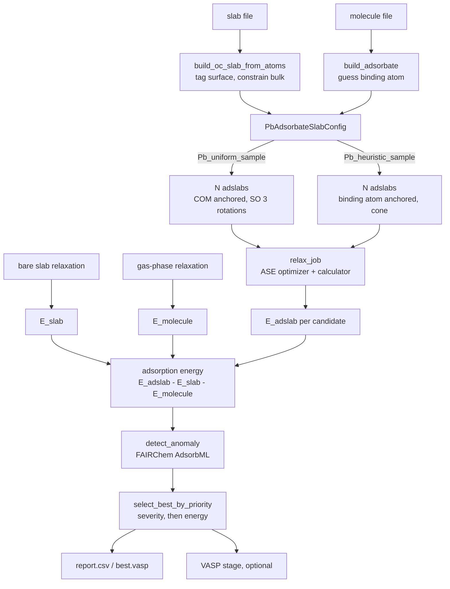
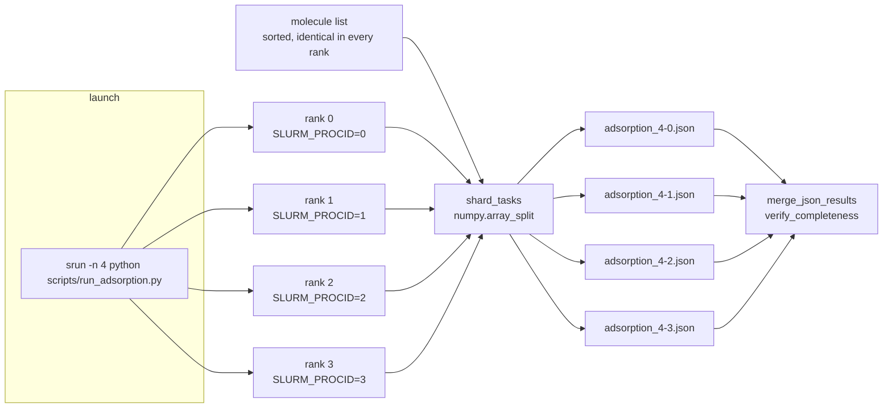

# Architecture

Three layers, and the rule that keeps them apart: **library code returns objects, scripts write
files, and nothing in `src/perovml/` knows about your cluster.**

```
scripts/*.py            batch runners: task lists, sharding, output directories
perovml.cli             the `perovml` console script, one module per subcommand
  │
perovml.recipes         run_adsorption_task: one molecule, resumable, stateful on disk
  │
perovml.core            placement.py (the samplers), recipes.py (generate → relax → rank)
  │
perovml.calculators     MockCalculator, DPA3Omat24Calculator
perovml.dft             VASPRunner, Bader analysis
perovml.parallel        Slurm sharding, result merging
perovml.utils           structure and POSCAR helpers
```

## Module map

| Module | Responsibility | Depends on |
|---|---|---|
| `core/placement.py` | `PbAdsorbateSlabConfig`: the two Pb-site samplers | FAIRChem `AdsorbateSlabConfig`, NumPy |
| `core/recipes.py` | `run_perovml`, `perov_adslab_generator`, `relax_job`, `select_best_by_priority` | `core/placement`, FAIRChem AdsorbML, ASE optimizers |
| `recipes/adsorption.py` | `run_adsorption_task`, `run_dft_stage`: the resumable per-molecule task | `core/recipes`, `dft/vasp` |
| `dft/vasp.py` | `VASPRunner`, `run_bader`, `calculate_charge_transfer` | ASE I/O, NumPy |
| `parallel/shard.py` | `get_slurm_env`, `shard_tasks`, `SimpleParallelRunner` | NumPy |
| `parallel/reduce.py` | `merge_json_results`, `reduce_results`, `verify_completeness` | pandas |
| `calculators/` | `MockCalculator`; `DPA3Omat24Calculator` behind the `dpa3` extra | DeePMD-kit (optional) |
| `utils/structure.py` | `build_oc_slab_from_atoms`, `build_adsorbate`, surface tagging | ASE, FAIRChem OC data |
| `utils/poscar_tools.py` | Selective-dynamics helpers, built on pymatgen `Poscar` | pymatgen |
| `cli/` | Argument parsing and dispatch only; heavy imports stay inside `run()` | everything above |

`perovml/__init__.py` resolves its public names lazily (PEP 562), so `import perovml` and
`perovml --help` stay fast and work without FAIRChem installed. Only the subcommand you actually
invoke pays for the heavy imports.

## Runtime data flow



The adsorption energy needs three relaxations, not one. In a screening run the slab term is computed
once and reused, which is why `run_adsorption_task` accepts `precomputed_slab_atoms` and
`precomputed_slab_energy`.

## Parallel execution

There is no MPI communicator and no distributed backend. Each rank is an independent process that
reads its own index out of the environment, takes a slice of the task list, and writes its own
result file. Ranks never talk to each other; merging happens afterwards, from files.



Three properties make this safe:

- **The task list is deterministic.** It comes from a sorted glob, so every rank builds the same
  list before slicing it.
- **`numpy.array_split` partitions.** The slices are disjoint, they cover everything, and they
  differ in length by at most one. With 10 molecules over 4 ranks:

  | Rank | Tasks |
  |---|---|
  | 0 | `mol_0 mol_1 mol_2` |
  | 1 | `mol_3 mol_4 mol_5` |
  | 2 | `mol_6 mol_7` |
  | 3 | `mol_8 mol_9` |

- **Output paths carry the rank.** Each rank writes `<prefix>_<num_jobs>-<job_num>.json`, so two
  ranks cannot collide, and a missing file names the rank that failed.

`get_slurm_env()` reads `SLURM_PROCID`, `SLURM_NTASKS`, `SLURM_LOCALID`, `SLURM_JOB_ID` and
`SLURM_NODELIST`. Outside Slurm every one of them is absent, the environment reads back as
`job_num=0, num_jobs=1, is_slurm=False`, and `shard_tasks` returns the list unchanged — the same
script runs unmodified on a laptop as one shard.

### Common questions

**How many shards do I get?** Exactly `SLURM_NTASKS`, which is what `srun -n` sets. There is no
separate shard-count setting to keep in step with it.

**More ranks than molecules?** The surplus ranks get empty slices, do nothing and write empty result
files. Harmless, but it wastes the GPUs they hold.

**Uneven molecules?** `array_split` gives the remainder to the lowest-numbered ranks, so rank 0
finishes last. For a long run with very unevenly sized molecules, more shards than nodes and a
smaller per-shard wall-clock is the simpler remedy; the resume then absorbs the ragged edge.

**One rank died. What now?** Re-run the same command against the same output directory. Completed
molecules are skipped by `status.json`, so only the lost work is redone.
[adsorption_workflow.md](adsorption_workflow.md) has the details.

**Where is the reduce step?** It is not automatic. Call `merge_json_results` or `reduce_results`
(which returns a pandas `DataFrame` and writes `combined.csv` / `combined.json`) after the job, or
run `scripts/run_parallel_simple.py --reduce-only` against the run directory.

## Extension points

- **A new calculator.** Anything that satisfies the ASE calculator interface works. Add a branch and
  an alias to `perovml.calculators.factory.build_calculator`, which every entry point resolves its
  `calculator:` key through, or pass the object directly to `run_perovml(..., calculator=...)`.
- **A new sampler.** Subclass `PbAdsorbateSlabConfig` or FAIRChem's `AdsorbateSlabConfig` and set
  `self.atoms_list` and `self.metadata_list` in `__init__`, which is the whole contract the rest of
  the pipeline relies on.
- **A different DFT code.** `VASPRunner` is only used through `generate_inputs`, `run` and
  `parse_results`. A class with those three methods can be substituted in `run_dft_stage`;
  `parse_results` must set `converged` to true only for a converged run, since the stage records no
  energy without it.
- **A different scheduler.** Replace `get_slurm_env`; `shard_tasks` needs nothing but a rank and a
  count.
