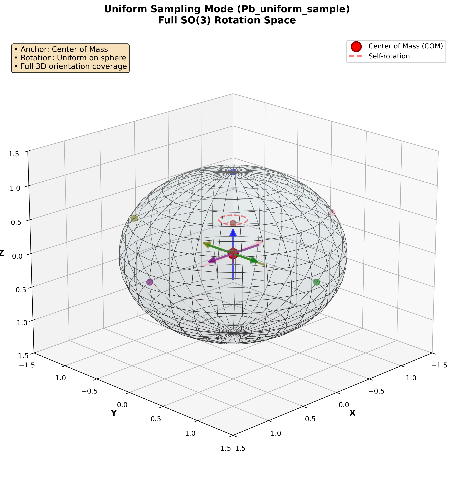
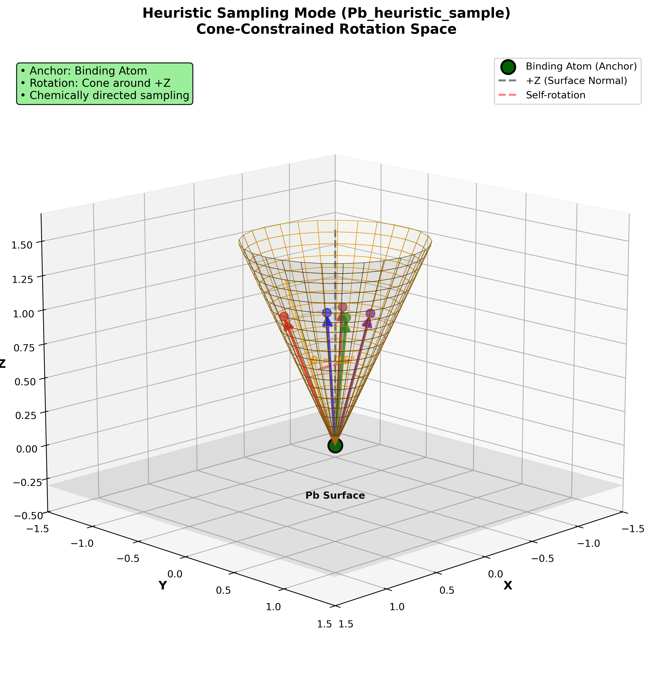
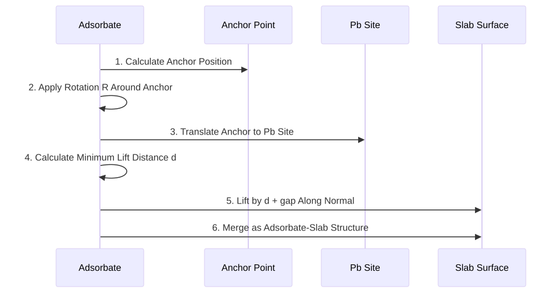

# Adsorbate Placement Algorithm for Pb-I Surfaces

Source: `src/perovml/core/placement.py`. Configuration keys: [parameters.md](parameters.md).
Where the samplers sit in the pipeline: [architecture.md](architecture.md).

## 1. Overview

`PbAdsorbateSlabConfig` subclasses FAIRChem's `AdsorbateSlabConfig` and replaces its site selection
and orientation sampling with logic specialised for a Pb-I terminated surface. Two modes:
- **Pb_uniform_sample (Uniform Sampling Mode)**: Uniform SO(3) rotation sampling with center-of-mass anchoring
- **Pb_heuristic_sample (Heuristic Sampling Mode)**: Cone-constrained directional sampling with binding-atom anchoring

## 2. Overall Algorithm Architecture

## 3. Core Algorithm Details

### 3.1 Pb Site Selection Algorithm

**Key Features**:
- **Target Atom**: Surface lead atoms (Z=82, tag=1)
- **Selection Criterion**: Closest to (0.5, 0.5) in xy fractional coordinate space
- **Distance Metric**: Torus distance accounting for periodic boundary conditions

### 3.2 Mode 1: Pb_uniform_sample (Uniform Sampling Mode)

#### 3D Rotation Schematic

*Figure: Uniform Sampling Mode - The molecule (rod-like) is anchored at its center of mass, can orient anywhere on a full sphere, and can rotate around its own axis*

#### Algorithm Workflow

**Algorithm Characteristics**:
- **Rotation Space**: Complete SO(3) three-dimensional rotation group
- **Sampling Method**: Marsaglia quaternion-based uniform sampling, ensuring unbiased rotation distribution
- **Anchor Point**: Center of Mass (COM) of the adsorbate molecule
- **Use Case**: Exploring all possible molecular orientations, suitable for initial screening

**Mathematical Principles**:
- Quaternion $q = (q_1, q_2, q_3, q_4)$ uniformly distributed on the $S^3$ unit hypersphere
- Rotation matrices parameterized by quaternions ensure uniform coverage of SO(3)

### 3.3 Mode 2: Pb_heuristic_sample (Heuristic Sampling Mode)

#### 3D Rotation Schematic

*Figure: Heuristic Sampling Mode - The molecule (rod-like) is anchored at its binding atom (cone apex), orientations are constrained within a cone around +Z axis, and can rotate around its own axis*

#### Algorithm Workflow

**Algorithm Characteristics**:
- **Rotation Space**: Cone region centered around +Z direction (surface normal) with half-angle θ
- **Sampling Method**: Spherical cap spiral + axial twist sampling
- **Anchor Point**: Binding atom of the adsorbate (atom directly interacting with surface)
- **Use Case**: Refined sampling for specific chemical binding directions, improving computational efficiency

**Mathematical Principles**:
- Cone constraint: $\beta \in [0, \theta]$, where $\beta$ is the polar angle relative to the +Z axis
- Sampling decomposition: directional sampling ($\beta, \psi$) + twist sampling ($\phi$)
- Exactly $N$ orientations are generated, one per sample $i = 0 \dots N-1$:
  $\cos\beta_i = 1 - \frac{i}{N-1}(1 - \cos\theta)$, so the polar angle runs from $0$ on the cone
  axis (the upright geometry) out to $\theta$ on the rim, spread evenly in $\cos\beta$, i.e. by cap
  area rather than by angle
- Azimuth $\psi_i = i \cdot \gamma$ with the golden angle $\gamma = \pi(3-\sqrt5)$, so no two
  samples share a meridian; twist $\phi_i = 2\pi i / N$
- The sampler is deterministic: the same $N$ and $\theta$ always give the same orientations

## 4. Comparison of Two Modes

| Feature | Pb_uniform_sample | Pb_heuristic_sample |
|---------|-------------------|---------------------|
| **Anchoring Strategy** | Center of Mass (COM) anchoring | Binding atom anchoring |
| **Rotation Sampling** | Full SO(3) uniform distribution | Cone-constrained region |
| **Sampling Efficiency** | Low (requires many samples for coverage) | High (focused on chemically relevant regions) |
| **Physical Meaning** | Explore all possible orientations | Simulate realistic binding configurations |
| **Application Stage** | Initial screening | Refined optimization |

## 5. Key Algorithm Components

### 5.1 Rotation Matrix Utility Functions

- **`_rot_axis_angle(axis, angle)`**: Rodrigues formula for rotation about arbitrary axis
  $$R = I + K\sin\theta + K^2(1-\cos\theta)$$
  where $K$ is the skew-symmetric matrix of the axis vector

- **`_rot_a_to_b(a, b)`**: Computes the minimum rotation that aligns vector a to b
  - Rotation axis: $v = a \times b$
  - Rotation angle: $\theta = \arctan2(\|v\|, a \cdot b)$

### 5.2 Structure Placement Workflow

### 5.3 Collision Avoidance Mechanism

The `_get_scaled_normal` function (inherited from parent class) calculates the minimum lift distance along the surface normal to ensure:
- No overlap between adsorbate atoms and surface atoms
- Additional safety gap `interstitial_gap` (default 0.1 Å)

## 6. Output Structure

Each mode generates `N` adsorbate-slab configurations with the following outputs:
- **atoms_list**: List of ASE Atoms objects containing complete atomic coordinates and cell information
- **metadata_list**: List of metadata dictionaries recording the Pb site coordinates and rotation matrix R for each structure

Tag definitions:
- `tag = 0`: Bulk atoms
- `tag = 1`: Surface atoms  
- `tag = 2`: Adsorbate atoms

## 7. Scope and Limitations

- **One site per slab.** Both modes place the adsorbate at the single surface Pb atom nearest the
  cell centre. They do not scan sites. If the interesting chemistry happens at an iodine, a vacancy
  or a step edge, these are the wrong samplers, and FAIRChem's own `random` and `heuristic` modes —
  reachable through the same `perovml place --mode` flag — sample sites instead.
- **The surface must be tagged.** Site selection looks for atoms with `Z = 82` and `tag = 1`. A slab
  with no tags is tagged automatically by the top fraction of its *z* range, which is a heuristic,
  not an analysis of the termination. Check the `Pb:I` ratio the log reports.
- **Rigid molecules.** The adsorbate is rotated as a rigid body; conformers are not explored. For a
  flexible molecule, generate the conformers upstream and treat each as a separate adsorbate.
- **The lift is geometric.** `interstitial_gap` guarantees only that the initial structure has no
  overlap. Whether the relaxation then finds a bound state is the calculator's business, and
  AdsorbML's anomaly detection is what flags the cases where it did not.

Downstream, the generated configurations are relaxed and ranked by
[the adsorption workflow](adsorption_workflow.md), and the survivors can be handed to
[the VASP stage](vasp_stage.md).

